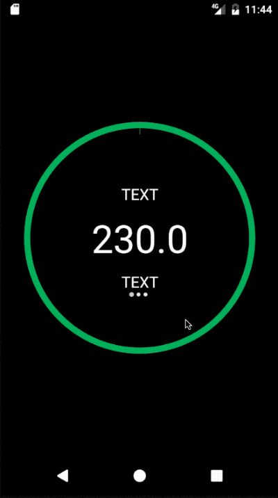

CircularBarPager [](https://android-arsenal.com/details/1/1426)
================

A Lollipop material design styled CircularBarPager library (API 10+). 

To include in your project, add this to your build.gradle file:

```
   //CircularBarPager
   compile 'com.github.orangegangsters:library:1.2.7@aar'
```


========
### By
Developers:
        [Olivier Goutay](https://github.com/olivierg13) and [Stoyan Dimitrov](https://github.com/StoyanD)

Designers:
        [Daniel Waldron](http://danielwaldron.com/)

### Usage

Look at the example app for a live example on how to use the library.

#### Preparing dependencies

In order to use the CirclePageIndicator by Square, you need to add a repo to your main build.gradle file:
```
allprojects {
    repositories {
        maven { url 'http://dl.bintray.com/populov/maven/' }
        jcenter()
    }
}
```

#### In XML:

```
<com.github.OrangeGangsters.circularbarpager.library.CircularBarPager
        android:id="@+id/circularBarPager"
        android:layout_height="match_parent"
        android:layout_width="match_parent"
        android:paddingLeft="30dp"
        android:paddingRight="30dp"
        android:layout_centerInParent="true"
        style="@style/CircularBarPagerStyle"/>
```

#### In styles.xml

```
 <style name="CircularBarPagerStyle">
        <item name="android:layout_height">match_parent</item>
        <item name="android:layout_width">match_parent</item>

        <item name="progress_arc_max">100</item>
        <item name="arc_progress">0</item>


        <item name="progress_arc_clockwise_outline_width">0.75dp</item>
        <item name="progress_arc_counter_clockwise_outline_width">0.75dp</item>
        <item name="progress_arc_clockwise_width">8dp</item>
        <item name="progress_arc_counter_clockwise_width">8dp</item>
        
        <item name="progress_start_line_enabled">true</item>
        <item name="progress_pager_on_click_enabled">true</item>
        <item name="progress_pager_fill_circle_color">#00000000</item>
</style>
```

========

### Customization

You can change several attributes in the XML file:

* app:arc_progress [integer def:0 0-100] --> The default arc progress when start up
* app:progress_arc_max [integer def:100 0-100] --> The maximum arc progress
* app:progress_arc_clockwise_color [color hex] --> The main color in clockwise mode
* app:progress_arc_clockwise_outline_color [color hex] --> The outline color in clockwise mode
* app:progress_arc_counter_clockwise_color [color hex] --> The outline color in counter-clockwise mode
* app:progress_arc_counter_clockwise_outline_color [color hex] --> The outline color in counter-clockwise mode
* app:progress_arc_clockwise_width [integer dp] --> The width size of the main color in clockwise mode
* app:progress_arc_clockwise_outline_width [integer dp] --> The width size of the outline color in clockwise mode
* app:progress_arc_counter_clockwise_width [integer dp] --> The width size of the color in counter-clockwise mode
* app:progress_arc_counter_clockwise_outline_width [integer dp] --> The width size of the outline color in counter-clockwise mode
* app:progress_pager_on_click_enabled [boolean] --> The boolean that enables or disables the click enabled (on click, changes page)
* app:progress_start_line_enabled [boolean] --> The boolean that enables the line that displays the starting position of the pager
* app:progress_pager_on_click_enabled [boolean] --> The boolean that enables the user to change pages with a click as well as a slide
* app:progress_pager_fill_circle_color [color hex] --> The color to fill the circle, transparent as default
* app:progress_pager_fill_mode [enum int] --> The mode to fill the circle, "default_mode" or "pie_mode"


You can access every components programmatically by getting the CircularBarPager object:

```
CircularBarPager mCircularBarPager = (CircularBarPager) findViewById(R.id.circularBarPager);
CircularBar circularBar = mCircularBarPager.getCircularBar();
ViewPager viewPager = mCircularBarPager.getViewPager();
CirclePageIndicator circlePageIndicator = mCircularBarPager.getCirclePageIndicator();
```

========

### Credits

* We used ViewPagerIndicator from JakeWharton (https://github.com/JakeWharton/ViewPagerIndicator) for the page indicator at the bottom of the CircularBarPager
* We used NineOldAndroids from JakeWharton (https://github.com/JakeWharton/NineOldAndroids/) to use beautiful animations on API 10+
* We used AnimationEasingFunctions from daimajia (https://github.com/daimajia/AnimationEasingFunctions) to also use beautiful animations on API 10+

========

### License

```
The MIT License (MIT)

Copyright (c) 2015 OrangeGangsters

Permission is hereby granted, free of charge, to any person obtaining a copy
of this software and associated documentation files (the "Software"), to deal
in the Software without restriction, including without limitation the rights
to use, copy, modify, merge, publish, distribute, sublicense, and/or sell
copies of the Software, and to permit persons to whom the Software is
furnished to do so, subject to the following conditions:

The above copyright notice and this permission notice shall be included in all
copies or substantial portions of the Software.

THE SOFTWARE IS PROVIDED "AS IS", WITHOUT WARRANTY OF ANY KIND, EXPRESS OR
IMPLIED, INCLUDING BUT NOT LIMITED TO THE WARRANTIES OF MERCHANTABILITY,
FITNESS FOR A PARTICULAR PURPOSE AND NONINFRINGEMENT. IN NO EVENT SHALL THE
AUTHORS OR COPYRIGHT HOLDERS BE LIABLE FOR ANY CLAIM, DAMAGES OR OTHER
LIABILITY, WHETHER IN AN ACTION OF CONTRACT, TORT OR OTHERWISE, ARISING FROM,
OUT OF OR IN CONNECTION WITH THE SOFTWARE OR THE USE OR OTHER DEALINGS IN THE
SOFTWARE.
```
